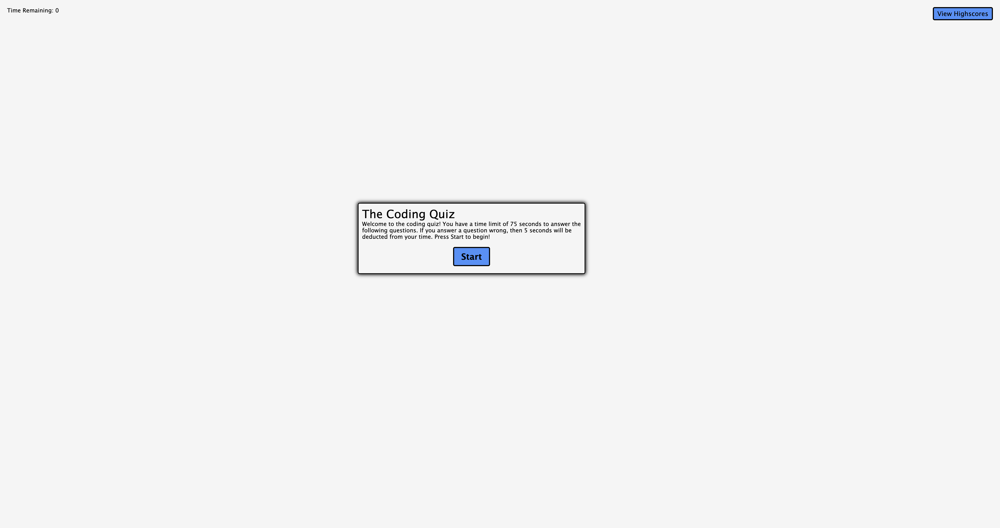

# Quiz-Game

## Description

This is a coding quiz game. Once you press start, you will have a time limit of 75 seconds to finish the quiz. If you get an answer wrong, then you will have 5 seconds deducted from your time. At the end, you will be asked to enter your initals for your highscore and it will be saved in your local store.

## Table of contents

- Where to find
- How to play
- Credit
- License
- Screenshot

## Where to find

Deployed link: [Quiz-game](https://connor812.github.io/Quiz-Game/)

## How to play

Once you are on the page, you can either press the start button to start the quiz, or click the view highscores button in the top left to view your previous highscores. Once you click start, a timer will start counting down from 75, and you have 75 seconds to complete the quiz. Chose from 1 of 4 buttons and it will tell you whether you guessed correctly or wrong as it displays the next question. If you answer wrong, 5 seconds will be taken off your time limit. Once you have completed all the questions or you have run out of time, it will ask you to enter your initials to save you highscore which is your total questions right, and the time you had left on your quiz. Then it will display your highscore on the board as well as any of your previous scores. Press restart button to play again.

## Credit

Connor Savoy was teh developer and big thanks to the University of Toronto for teaching me how to code this project.

## License

GNU GENERAL PUBLIC LICENSE
Version 3, 29 June 2007

# Screenshot

